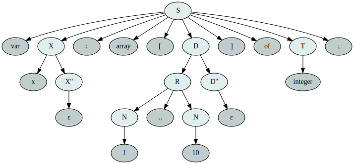

# Лабораторная работа №2. Ручное построение нисходящих синтаксических анализаторов.
## Вариант 9. Описание массивов в Паскале

*Илья Бизяев, курс «Методы трансляции», ИТМО, 2019*

### Формулировка задания
Массив в Pascal. Заголовок начинается ключевым словом `var`, далее идёт имя массива,
двоеточие, ключевое слово `array`, далее описание диапазона индексов, затем `of` и
имя типа. Диапазон индексов представляет собой две границы, между которыми две точки.  
Используйте один терминал для всех имен переменных и имен типов. Используйте один
терминал для ключевого слов `var` и `array` (не несколько `v`, `a`, `r`).  
Пример: `var x: array [1..10] of integer`;

### Грамматика
Построим грамматику для указанного класса выражений:

| Нетерминал              | Описание                                                     |
| ----------------------- | ------------------------------------------------------------ |
| `S -> V X : A [D] O T;` | Массив в Pascal состоит из V — ключевого слова `var`, X — имени массива, далее `:` и A - `array`, D — списка диапазонов значений индексов, заключённого в квадратные скобки, O — `of`, T — типа элементов в массиве, `;`. |
| `D -> D,D or R`         | Массив может быть n-мерным, поэтому каждый список диапазонов может состоять из двух, разделённых запятой, или же являться одним диапазоном R. |
| `R -> N..N or T`        | Диапазон индексов состоит из двух чисел N, разделённых двумя точками, либо одного названия типа (идентификатора). |
| `X -> X,X or id`        | Объявление массивов может состоять из одного или нескольких имён, имя каждого — идентификатор. |
| `T -> id`               | По условию для имён массивов и имен типов используется один терминал — идентификатор. |
| `N -> number`           | У чисел свой идентификатор, чтобы отличать их от имён.       |

Для построения нисходящего парсера без возврата требуется [LL(1)-грамматика](https://neerc.ifmo.ru/wiki/index.php?title=LL(k)-грамматики,_множества_FIRST_и_FOLLOW), а выбранная
грамматика в силу наличия левой рекурсии и правого ветвления таковой не является. Устраним [левую рекурсию](https://neerc.ifmo.ru/wiki/index.php?title=Устранение_левой_рекурсии) и [правое ветвление](https://neerc.ifmo.ru/wiki/index.php?title=LL(k)-грамматики,_множества_FIRST_и_FOLLOW#.D0.90.D0.BB.D0.B3.D0.BE.D1.80.D0.B8.D1.82.D0.BC_.D1.83.D1.81.D1.82.D1.80.D0.B0.D0.BD.D0.B5.D0.BD.D0.B8.D1.8F_.D0.BF.D1.80.D0.B0.D0.B2.D0.BE.D0.B3.D0.BE_.D0.B2.D0.B5.D1.82.D0.B2.D0.BB.D0.B5.D0.BD.D0.B5.D0.BD.D0.B8.D1.8F) в правилах для D и X, используя соответствующие алгоритмы.  
Получится грамматика:

| Нетерминал               | Описание                                     |
| ------------------------ | -------------------------------------------- |
| `S  -> V X : A [D] O T;` | Описание массива в Pascal                    |
| `D  -> RD''`             | Список диапазонов индексов                   |
| `R  -> N..N or T`        | Один диапазон                                |
| `D''-> D'`               | Продолжение списка диапазонов                |
| `D''-> ε`                | Конец списка диапазонов                      |
| `D' -> ,DP`              | Описание нового диапазона индексов           |
| `P  -> D'`               | Продолжение нового диапазона                 |
| `P  -> ε `               | Конец списка                                 |
| `X  -> idX''`            | Список имён массивов                         |
| `X''-> X'`               | Продолжение списка имён массивов             |
| `X''-> ε`                | Конец списка имён массивов                   |
| `X' -> ,XY`              | Описание нового имени элемента в списке имён |
| `Y  -> X'`               | Новый элемент списка имён                    |
| `Y  -> ε`                | Конец списка имён                            |
| `T  -> id`               | Тип элементов массива                        |
| `N  -> number`           | Числовая граница индексов массива            |

### Лексический анализатор
Лексический анализатор получает на вход строку и выдаёт последовательность терминалов
(токенов). Пробелы и переводы строк игнорируются.

| Терминал  | Токен         |
|-----------|---------------|
| `<id>`    | Id            |
| `<number>`| Number        |
| `var`     | Var           |
| `:`       | Colon         |
| `array`   | Array         |
| `[`       | OpenSBracket  |
| `..`      | DoubleDot     |
| `,`       | Comma         |
| `]`       | CloseSBracket |
| `of`      | Of            |
| `;`       | Semicolon     |
| `ε`       | Epsilon       |
| `$`       | Eof           |

### Синтаксический анализатор
Для написания парсера нам требуется построить множества [FIRST и FOLLOW](https://neerc.ifmo.ru/wiki/index.php?title=LL(k)-грамматики,_множества_FIRST_и_FOLLOW#defLLK) для нетерминалов нашей грамматики:

|      | FIRST     | FOLLOW      |
|------|-----------|-------------|
| `S`  | `var`     | `$`         |
| `D`  | `n`       | `]`,`,`     |
| `D'` | `,`       | `]`,`,`     |
| `D''`| `ε`,`,`   | `]`,`,`     |
| `R`  | `n`       | `,`,`]`     |
| `P`  | `ε`,`,`   | `]`,`,`     |
| `X`  | `<id>`    | `:`,`,`     |
| `X'` | `,`       | `:`,`,`     |
| `X''`| `ε`,`,`   | `:`,`,`     |
| `Y`  | `ε`,`,`   |  `:`,`,`    |
| `T`  | `<id>`    | `;`         |
| `N`  | `<number>`| `.`,`,`,`]` |

### Визуализация дерева разбора
Построенные деревья разбора можно представлять графически, например, сохраняя их в формате
[Dot (Graphviz)](https://en.wikipedia.org/wiki/DOT_(graph_description_language)) и конвертируя в векторные файлы SVG.

### Набор тестов
Тесты для лексического и синтаксического анализаторов написаны с использованием встроенных
средств тестирования языка Rust; краткое описание тестов обозначено в названиях тестовых
функций.

### Сборка и использование программы
**Структура программы**

* [main.rs](src/main.rs) — точка входа программы. Принимает на стандартный ввод выражение для разбора,
выводит в стандартный вывод дерево разбора в формате [Dot (Graphviz)](https://en.wikipedia.org/wiki/DOT_(graph_description_language)).
* [lexer.rs](src/parser/lexer.rs) — лексический анализатор.
* [parser.rs](src/parser.rs) — синтаксический анализатор.
* [lexer/tests.rs](src/parser/lexer/tests.rs), [parser/tests.rs](src/parser/tests.rs) — тесты.

**Зависимости**  
Решение использует только стандартную библиотеку Rust и протестировано с `rustc 1.39.0`.

**Команды**

* Пример запуска решения:  
`echo "var x: array [1..10] of integer;" | cargo run | dot -Tsvg > test.svg`
* Запуск тестов:  
`cargo test`
* Сборка без запуска:  
`cargo build [--release]`
